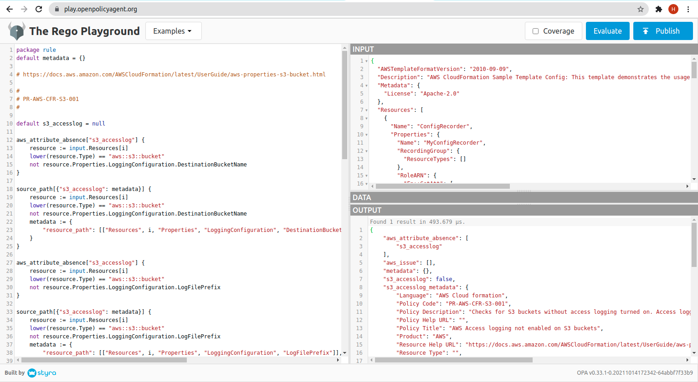

# Best Practices to create custom policies for Prancer Security Platform

## Introduction
Prancer Cloud Security Platform supports more than 800 security policies out of the box. And Prancer team maintains these policies across different clouds. But it is still possible that you need to create custom policies to comply with internal requirements. This document discusses best practices and guidelines to create new custom policies for Prancer Platform based on OPA Rego policy language.

## 1. Policy Code

The policy code of a rule should follow this pattern.

- `PR-<CLOUD TYPE>-<TEMPLATE TYPE>-<RESOURCE TYPE>-<UNIQUE ID>`

Example

- `PR-AWS-CFR-S3-001`

## 2. Initialize default evalution variable

- `default s3_accesslog = null`

## 3. Write the rule to verify your resource configurations

2 situations exist when you check the configuration of a resource
In any rule, we always check resource type

### **a. Attribute is not exist**

The attribute which you want to check in your configuration does not exist in your file.

```
aws_attribute_absence["s3_accesslog"] {
    resource := input.Resources[i]
    lower(resource.Type) == "aws::s3::bucket"
    not resource.Properties.LoggingConfiguration.DestinationBucketName
}
```

### **b. Policy issue exist in configuration**

```
aws_issue["s3_accesslog"] {
    resource := input.Resources[i]
    lower(resource.Type) == "aws::s3::bucket"
    count(resource.Properties.LoggingConfiguration.DestinationBucketName) == 0
}
```

## 4. Send failed resource path in issue metadata

`source_path contains same logic of the issue with an extra field on metadata, which sends path of failed resource.`

```
source_path[{"s3_accesslog": metadata}] {
    resource := input.Resources[i]
    lower(resource.Type) == "aws::s3::bucket"
    not resource.Properties.LoggingConfiguration.DestinationBucketName
    metadata := {
        "resource_path": [["Resources", i, "Properties", "LoggingConfiguration", "DestinationBucketName"]],
    }
}
```


## 5. Update the evalution variable value to `true` or `false`

```
s3_accesslog {
    lower(input.Resources[i].Type) == "aws::s3::bucket"
    not aws_issue["s3_accesslog"]
    not aws_attribute_absence["s3_accesslog"]
}

s3_accesslog = false {
    aws_issue["s3_accesslog"]
}
```

## 6. Set the proper error message

```
s3_accesslog_err = "AWS Access logging not enabled on S3 buckets" {
    aws_issue["s3_accesslog"]
} else = "S3 Bucket attribute DestinationBucketName/LogFilePrefix missing in the resource" {
    aws_attribute_absence["s3_accesslog"]
}
```

## 7. Define the Metadata

```
s3_accesslog_metadata := {
    "Policy Code": "PR-AWS-CFR-S3-001",
    "Type": "IaC",
    "Product": "AWS",
    "Language": "AWS Cloud formation",
    "Policy Title": "AWS Access logging not enabled on S3 buckets",
    "Policy Description": "Checks for S3 buckets without access logging turned on. Access logging allows customers to view complete audit trail on sensitive workloads such as S3 buckets",
    "Resource Type": "aws::s3::bucket",
    "Policy Help URL": "https://github.com/prancer-io/prancer-compliance-test/blob/development/aws/iac/storage.rego#L8",
    "Resource Help URL": "https://docs.aws.amazon.com/AWSCloudFormation/latest/UserGuide/aws-properties-s3-bucket.html"
}
```

- `Policy Code:` which should be the same as defined at the starting of the test and must be unique across all rules in the project
- `Type:` type of policy, available values are: IAC and Cloud
- `Product:` type of the cloud, for example 'AWS'
- `Language`: related to the product, for example, for product 'AWS' Languange will be 'AWS Cloud Formation'
- `Title`: Title of the policy
- `"Resource Type"`: type of the resource, in this example value is `aws::s3::bucket`,
- `Description`: Description of the policy
- `Policy Help URL`: more information about the rule
- `Resource Help URL`: more information about the resource

## Complete Example

```
package rule
default metadata = {}

# https://docs.aws.amazon.com/AWSCloudFormation/latest/UserGuide/aws-properties-s3-bucket.html
# https://docs.aws.amazon.com/AWSCloudFormation/latest/UserGuide/aws-properties-s3-policy.html

#
# PR-AWS-CFR-S3-001
#

default s3_accesslog = null

aws_attribute_absence["s3_accesslog"] {
    resource := input.Resources[i]
    lower(resource.Type) == "aws::s3::bucket"
    not resource.Properties.LoggingConfiguration.DestinationBucketName
}

source_path[{"s3_accesslog": metadata}] {
    resource := input.Resources[i]
    lower(resource.Type) == "aws::s3::bucket"
    not resource.Properties.LoggingConfiguration.DestinationBucketName
    metadata := {
        "resource_path": [["Resources", i, "Properties", "LoggingConfiguration", "DestinationBucketName"]],
    }
}

aws_attribute_absence["s3_accesslog"] {
    resource := input.Resources[i]
    lower(resource.Type) == "aws::s3::bucket"
    not resource.Properties.LoggingConfiguration.LogFilePrefix
}

source_path[{"s3_accesslog": metadata}] {
    resource := input.Resources[i]
    lower(resource.Type) == "aws::s3::bucket"
    not resource.Properties.LoggingConfiguration.LogFilePrefix
    metadata := {
        "resource_path": [["Resources", i, "Properties", "LoggingConfiguration", "LogFilePrefix"]],
    }
}

aws_issue["s3_accesslog"] {
    resource := input.Resources[i]
    lower(resource.Type) == "aws::s3::bucket"
    count(resource.Properties.LoggingConfiguration.DestinationBucketName) == 0
}

source_path[{"s3_accesslog": metadata}] {
    resource := input.Resources[i]
    lower(resource.Type) == "aws::s3::bucket"
    count(resource.Properties.LoggingConfiguration.DestinationBucketName) == 0
    metadata := {
        "resource_path": [["Resources", i, "Properties", "LoggingConfiguration", "DestinationBucketName"]],
    }
}

aws_issue["s3_accesslog"] {
    resource := input.Resources[i]
    lower(resource.Type) == "aws::s3::bucket"
    count(resource.Properties.LoggingConfiguration.LogFilePrefix) == 0
}

source_path[{"s3_accesslog": metadata}] {
    resource := input.Resources[i]
    lower(resource.Type) == "aws::s3::bucket"
    count(resource.Properties.LoggingConfiguration.LogFilePrefix) == 0
    metadata := {
        "resource_path": [["Resources", i, "Properties", "LoggingConfiguration", "LogFilePrefix"]],
    }
}

s3_accesslog {
    lower(input.Resources[i].Type) == "aws::s3::bucket"
    not aws_issue["s3_accesslog"]
    not aws_attribute_absence["s3_accesslog"]
}

s3_accesslog = false {
    aws_issue["s3_accesslog"]
}

s3_accesslog = false {
    aws_attribute_absence["s3_accesslog"]
}

s3_accesslog_err = "AWS Access logging not enabled on S3 buckets" {
    aws_issue["s3_accesslog"]
} else = "S3 Bucket attribute DestinationBucketName/LogFilePrefix missing in the resource" {
    aws_attribute_absence["s3_accesslog"]
}

s3_accesslog_metadata := {
    "Policy Code": "PR-AWS-CFR-S3-001",
    "Type": "IaC",
    "Product": "AWS",
    "Language": "AWS Cloud formation",
    "Policy Title": "AWS Access logging not enabled on S3 buckets",
    "Policy Description": "Checks for S3 buckets without access logging turned on. Access logging allows customers to view complete audit trail on sensitive workloads such as S3 buckets",
    "Resource Type": "",
    "Policy Help URL": "",
    "Resource Help URL": "https://docs.aws.amazon.com/AWSCloudFormation/latest/UserGuide/aws-properties-s3-bucket.html"
}
```

## Validate the Rule using [Rego Playground](https://play.openpolicyagent.org/)

- Put the rego rule in the left side of the panel.

- Put input JSON in `Input` section.

- Run the compliance using `Evaluate` button.

- Varify the output as follow:
  - If the rule get passed, then you can see the value  `s3_accesslog = True`
  - If the rule get failed then you can see the value  `s3_accesslog = False`
  - if the rule gets skipped due to the type of the resource not matched, then you can see `s3_accesslog = null`
  - also, the source_path shows the path of failed resources
  - before deploying the rule, a developer must test the rule here.

    here is an example:
    


## Handle dependency between resource in Terraform (Example here is for Azure but it should be same for all provider)

- Each terraform resources will have a `compiletime_identity` under resource `property` in snapshot json.
- If a resource has a dependency with another resource, we just need to do a `contains` check on source resource property (which should contains the target resources identity) with taget resources `compiletime_identity` or `dot (.)` combination of taget resources `type` and `name`.
- Example: `azurerm_virtual_machine_extension` has dependency with `azurerm_virtual_machine`. `azurerm_virtual_machine_extension` property `virtual_machine_id` should contains `id` of target `azurerm_virtual_machine`. We will raise an issue if `virtual_machine_id` does not contains `compiletime_identity` or `dot (.)` combination of `type` and `name` of traget `azurerm_virtual_machine`

```
azure_issue["vm_protection"] {
    resource := input.resources[_]
    lower(resource.type) == "azurerm_virtual_machine"
    count([c | r := input.resources[_];
              r.type == "azurerm_virtual_machine_extension";
              contains(r.properties.virtual_machine_id, resource.properties.compiletime_identity);
              lower(r.properties.type) == "iaasantimalware";
              c := 1]) == 0
    count([c | r := input.resources[_];
              r.type == "azurerm_virtual_machine_extension";
              contains(r.properties.virtual_machine_id, concat(".", [resource.type, resource.name]));
              lower(r.properties.type) == "iaasantimalware";
              c := 1]) == 0
}
```
- A complete example of writing custom rules for dependent resoruces:

```
package rule

#
# PR-AZR-TRF-VM-003
#

default vm_protection = null

azure_attribute_absence["vm_protection"] {
    count([c | input.resources[_].type == "azurerm_virtual_machine_extension"; c := 1]) == 0
}

azure_attribute_absence["vm_protection"] {
    resource := input.resources[_]
    lower(resource.type) == "azurerm_virtual_machine_extension"
    not resource.properties.type
}

azure_issue["vm_protection"] {
    resource := input.resources[_]
    lower(resource.type) == "azurerm_virtual_machine"
    count([c | r := input.resources[_];
              r.type == "azurerm_virtual_machine_extension";
              contains(r.properties.virtual_machine_id, resource.properties.compiletime_identity);
              lower(r.properties.type) == "iaasantimalware";
              c := 1]) == 0
    count([c | r := input.resources[_];
              r.type == "azurerm_virtual_machine_extension";
              contains(r.properties.virtual_machine_id, concat(".", [resource.type, resource.name]));
              lower(r.properties.type) == "iaasantimalware";
              c := 1]) == 0
}

vm_protection {
    lower(input.resources[_].type) == "azurerm_virtual_machine"
    not azure_attribute_absence["vm_protection"]
    not azure_issue["vm_protection"]
}

vm_protection = false {
    lower(input.resources[_].type) == "azurerm_virtual_machine"
    azure_issue["vm_protection"]
}

vm_protection = false {
    lower(input.resources[_].type) == "azurerm_virtual_machine"
    azure_attribute_absence["vm_protection"]
}

vm_protection_err = "azurerm_virtual_machine_extension property 'type' need to be exist. Its missing from the resource. Please set value to 'iaasantimalware' after property addition." {
    lower(input.resources[_].type) == "azurerm_virtual_machine"
    azure_attribute_absence["vm_protection"]
} else = "Azure Virtual Machine does not have endpoint protection installed" {
    lower(input.resources[_].type) == "azurerm_virtual_machine"
    azure_issue["vm_protection"]
}

vm_protection_metadata := {
    "Policy Code": "PR-AZR-TRF-VM-003",
    "Type": "IaC",
    "Product": "AZR",
    "Language": "Terraform",
    "Policy Title": "Azure Virtual Machine should have endpoint protection installed",
    "Policy Description": "This policy identifies Azure Virtual Machines (VMs) that do not have endpoint protection installed. Installing endpoint protection systems (like Antimalware for Azure) provides for real-time protection capability that helps identify and remove viruses, spyware, and other malicious software. As a best practice, install endpoint protection on all VMs and computers to help identify and remove viruses, spyware, and other malicious software.",
    "Resource Type": "azurerm_virtual_machine",
    "Policy Help URL": "",
    "Resource Help URL": "https://registry.terraform.io/providers/hashicorp/azurerm/latest/docs/resources/virtual_machine_extension"
}
```

